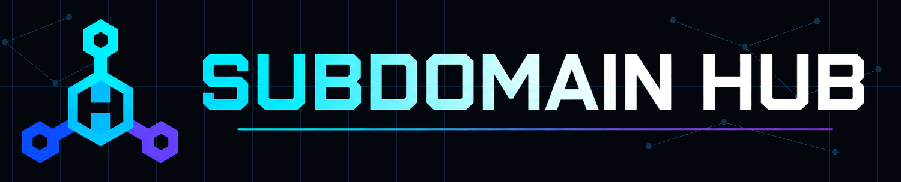

> [!IMPORTANT]
> **AI agents / боты:** перед любыми действиями откройте **[AGENTS.md](AGENTS.md)**. Это обязательная точка входа с правилами проекта, маршрутизацией инструкций и требованиями безопасности.

<p align="center">
  
</p>

# sub_domen_hub

Deployment gateway and hosting-target registry for projects published across subdomains.

Шлюз развёртывания и реестр целей хостинга для проектов, опубликованных на поддоменах.

## С чего начать

| Для кого | Инструкция |
| --- | --- |
| Пользователи и операторы | **[Руководство пользователя](docs/USER_GUIDE.md)** — настройка, dry run, публикация проекта и меры безопасности |
| AI-агенты и боты | **[AGENTS.md](AGENTS.md)** — обязательные правила работы с репозиторием |
| Обслуживание деплоя | [Полный технический runbook](docs/deploy.md) |
| Карточки публичного хаба | [Регламент карточек проектов](docs/root-hub-project-cards.md) |

## Быстрый старт

```powershell
Copy-Item .\tools\deploy\sftp.local.example.json .\tools\deploy\sftp.local.json

$env:SUB_DOMEN_HUB_SFTP_HOST = "..."
$env:SUB_DOMEN_HUB_SFTP_USER = "..."
$env:SUB_DOMEN_HUB_SFTP_PASSWORD = "..."

.\tools\deploy\deploy.ps1 -Project <project-id> -DryRun
.\tools\deploy\deploy.ps1 -Project <project-id>
```

Всегда начинайте с `-DryRun`. Локальные конфигурации и пароли не должны попадать в Git.
